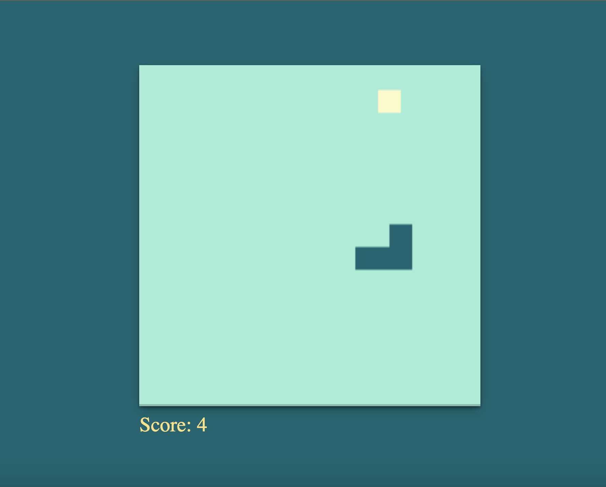
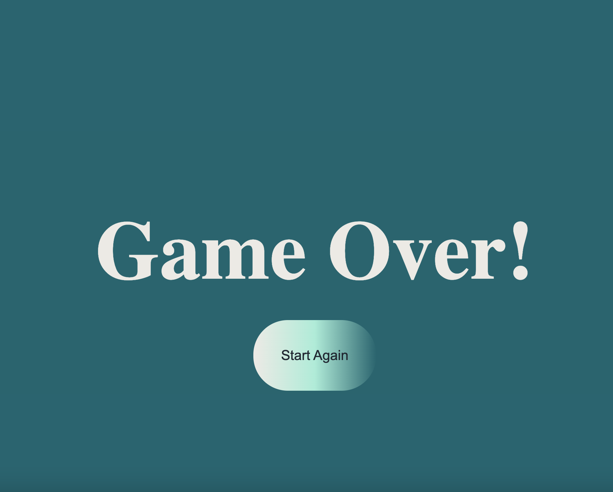

# Snake Game

A classic snake game implemented using JavaScript and HTML5 Canvas.

## Demo : 

## Description

This is a simple snake game where the player controls a snake using arrow keys and tries to eat food to grow longer. The game ends if the snake hits the wall or collides with itself.

The game features include:

- Snake movement controlled by arrow keys
- Randomly generated food for the snake to eat
- Snake grows longer each time it eats food
- Increasing game speed as the snake grows longer
- Game over screen with the option to restart the game

## How to Play

1. Open the game in a web browser.
2. Use the arrow keys to control the snake's movement: up, down, left, right.
3. The snake will move in the corresponding direction with each key press.
4. Guide the snake to eat the food represented by colored blocks on the canvas.
5. Each time the snake eats food, it will grow longer.
6. The game ends if the snake hits the wall or collides with itself.
7. When the game ends, a "Game Over" screen will be displayed.
8. Click the "Start Again" button to restart the game.

## Technologies Used

- JavaScript
- HTML5 Canvas

## Credits

This game is developed by [Mariami].

## Contact

For any inquiries or questions, feel free to contact at [gogaladzemariam8@gmail.com].

